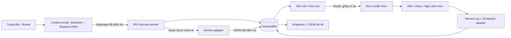

# Thiết kế Mạch Đọc

## Phạm vi và những điều không thể hứa

MVP ưu tiên lưu đúng, không mất tiến độ, sản xuất ngôn ngữ và quay lại đều đặn. Dữ liệu ở máy, không có backend riêng. **Gemini là dịch vụ từ xa**: yêu cầu “hoàn toàn client-side” khả thi theo nghĩa ứng dụng chạy phía người dùng, nhưng không đồng nghĩa mọi tính toán offline. Nếu tuyệt đối không gửi dữ liệu ra ngoài, dùng ghi chú + tự chấm; provider mô hình local là phase sau.

Không extension nào bảo đảm capture mọi trang: Chrome chặn trang đặc quyền, PDF/editor có thể không có text DOM; closed Shadow DOM và canvas không cung cấp Selection thông thường. Trang web có thể chủ động phá DOM, xoá host hoặc dùng fullscreen/top layer của riêng nó. Mạch Đọc hỗ trợ các trang HTTP(S) được Chrome cho phép, kiểm thử CSS cực đoan và iframe; không vượt cơ chế bảo vệ trình duyệt. [Content scripts của Chrome](https://developer.chrome.com/docs/extensions/develop/concepts/content-scripts).

Liên kết nguồn cũng không tuyệt đối: nội dung có thể sửa/xóa, cần đăng nhập, hoặc SPA chưa render đoạn. Ta giữ nguyên quote và ngữ cảnh làm phương án đọc lại ngay trong thư viện, đồng thời lưu URL trang cha/iframe, prefix/suffix, heading, scroll offset. Vị trí cuộn chỉ là gợi ý thủ công; chưa tự cuộn theo offset vì dễ chỉ sai đoạn.

## Các lớp và luồng dữ liệu

`AIProvider` có `analyze`, `grade`, `explain`. `Scheduler` có `initial`, `review`; UI đọc card state trung lập có số timestamp, không nhận object SDK. Composition hiện tại ở `provider()` và `scheduler` là nơi thay adapter. Đổi AI cần thêm adapter + quyền/CSP endpoint; đổi scheduler cần migrate trạng thái/khai báo version thuật toán, giữ toàn bộ review log. Không giả định chỉ đổi một tên hàm thì state FSRS dùng được cho SM-2.

Repository chịu trách nhiệm transaction và invariant, UI chỉ orchestration. `zod` là nguồn schema và runtime validation dùng chung, TypeScript strict không thay thế validation khi dữ liệu tới từ mô hình, message hay import. So với viết JSON Schema riêng + Ajv, Zod giảm schema/type lệch nhau nhưng bundle content lớn hơn; module tách và tree shaking giảm phần không dùng.

## Học như thế nào

| Lựa chọn | Phương án khác và trade-off | Cách áp dụng |
|---|---|---|
| **FSRS** qua thư viện `ts-fsrs` | SM-2 dễ tự triển khai nhưng mô hình đơn giản hơn, không đặt retention target trực tiếp theo cùng cách. Leitner dễ hiểu, các hộp có chu kỳ cứng, ít cá nhân hóa. | Chọn FSRS thay vì tự viết bản gần giống. Lưu stability, difficulty, state, due, lapses và review log. |
| **Retention rate target 90%** | Cao hơn giảm khả năng quên dự kiến nhưng tăng tải; thấp hơn nhẹ hơn nhưng quên nhiều hơn. | Cho chỉnh 80–97%; thay đổi áp dụng ở lượt ôn tiếp theo. Chưa train parameters cá nhân, không hứa “đúng thời điểm sắp quên” cho từng cá nhân. |
| **Active recall / production** | Lật thẻ nhanh hơn nhưng dễ nhầm quen mắt với nhớ được. | Bắt buộc thử gõ hoặc khai báo chưa nhớ trước khi thấy đáp án. Có AI chấm tương đương nghĩa, lỗi cụ thể, người học quyết định rating. |
| **Minimum information principle** | Gộp một capture vào một thẻ dễ triển khai nhưng khó biết phần nào sai. | Mỗi cấu trúc hoặc một nghĩa của một chunk có schedule riêng. Không tách công thức khỏi ý nghĩa sử dụng một cách máy móc. |
| **Cloze deletion** | Tự viết toàn câu khó hơn, trắc nghiệm nhẹ hơn. | Một lỗ trên câu gốc, chính xác về mặt trích dẫn; luân phiên cùng đơn vị với production, không tạo bản sao lịch chỉ vì đổi dạng câu hỏi. |
| **Interleaving** | Ôn theo nhóm liên tục cho cảm giác trôi chảy, ít luyện phân biệt. | Queue ưu tiên xen nhóm và tránh hai mục từ cùng capture liền nhau nếu có lựa chọn. Chưa bury toàn bộ sibling tới hôm sau. |
| **Desirable difficulty** | Quá dễ tạo nhận diện; quá khó gây bỏ học. | Bài viết vừa sức, hint có ghi nhận assisted, ví dụ mới dùng từ đơn giản. Sai không bị trừng phạt; lịch ngắn lại hoặc mục cần chăm sóc. |
| **Comprehensible input** | Sinh câu đầy từ khó mới có thể làm lệch bài tập sang từ vựng. | Nội dung do người học chọn, giải thích Việt trong ngữ cảnh, prompt yêu cầu ví dụ dễ hiểu. Chưa tự định lượng CEFR cá nhân. |
| **Collocation & chunking** | Tách từng từ dễ bỏ nghĩa cụm; lưu cả đoạn dài khó sản xuất. | AI tách chunk có nghĩa độc lập, phân biệt nghĩa trong key; danh sách từ quan trọng thể hiện thành các đơn vị phrase. |
| **Leech handling** | Tiếp tục ép ôn có thể phí thời gian; xóa làm mất ngữ cảnh. | Sau 5 lượt “Chưa nhớ” tích lũy, tạm dừng, giữ lịch sử, giải thích khác rồi chủ động tiếp tục. |

Việc dùng thư viện chính thức và record log dựa trên [API TS-FSRS](https://github.com/open-spaced-repetition/ts-fsrs). Chọn target là quyết định cân bằng của sản phẩm; xem phân tích tải học trong [The Optimal Retention của tác giả FSRS](https://github.com/open-spaced-repetition/fsrs4anki/wiki/The-Optimal-Retention). Các nguyên tắc tách kiến thức và cloze tham khảo [Twenty rules, SuperMemo](https://www.supermemo.com/en/blog/twenty-rules-of-formulating-knowledge); thiết kế recall, variation và interleaving tham khảo [Bjork Learning and Forgetting Lab](https://bjorklab.psych.ucla.edu/research/). Đây là vận dụng vào ngữ pháp theo phán đoán thiết kế, không phải chứng minh nghiên cứu trực tiếp rằng extension này cải thiện điểm tiếng Anh.

Một capture thường tạo 2–6 đơn vị nếu đủ nội dung; không ép “nhiều” với một từ đơn lẻ. Mỗi đơn vị luân phiên production → cloze → transfer, rồi quay vòng. Ví dụ transfer được sinh trong lần phân tích và tái sử dụng không tốn request mới; mục thủ công dùng câu/ghi chú gốc. Chưa tạo vô hạn ví dụ mới mỗi lần ôn để tránh quota và khó kiểm soát độ khó.

## MV3, vùng chọn và ranh giới trang

| Chọn | Thay thế | Trade-off / chi tiết |
|---|---|---|
| Manifest V3, worker theo sự kiện | Background page thường trực (MV2) | MV3 là kiến trúc hiện hành; cần thiết kế worker có thể dừng bất kỳ lúc nào. |
| Queue lease trong IndexedDB + `chrome.alarms` | Giữ queue/timer trong RAM | Job claim trong transaction; lease 90 giây, fetch timeout 23 giây, alarm định kỳ 1 phút, retry 4 lần. Kết quả cũ không ghi đè job đã được claim lại. |
| Isolated-world content scripts | Inject script vào MAIN world | Không chia sẻ JS scope với website; DOM vẫn chia sẻ. Message parse và lọc sender; không tạo bridge `window.postMessage` cho lệnh đặc quyền. |
| **Closed Shadow DOM + popover/dialog top layer** | CSS prefix + z-index tối đa hoặc iframe UI | Shadow cô lập CSS, top layer tránh stacking context. Closed root chỉ giảm can thiệp vô tình, không là ranh giới chống trang độc hại tuyệt đối. Iframe UI bảo vệ DOM hơn nhưng điều phối chiều cao/focus phức tạp. |
| Range/Selection API | `innerHTML` hoặc chỉ lấy text của element | Giữ vùng chọn qua inline nodes; chỉ lưu text, không lưu HTML chạy được. Thu ngữ cảnh giới hạn node/ký tự, bỏ form/editor. |
| `all_frames`, about-blank/origin fallback | Chỉ top frame | Capture trong iframe theo quyền Chrome. Click icon iframe gửi worker chuyển hộp thoại lên top; nếu không gửi được thì mở tại frame và có thể bị giới hạn kích thước. |
| Text Fragment với prefix/suffix | CSS selector/XPath hoặc scrollY | Selector dễ hỏng sau SPA redesign, scroll không xác định ngữ nghĩa. Text Fragment cũng hỏng nếu chữ thay đổi; luôn giữ quote gốc. |
| Commands + new tab override + badge | Popup tự mở / notifications cưỡng bức | Tab mới là điểm đi qua thường xuyên, badge nhẹ. Không tự mở tab ôn khi đang đọc. Build `NO_NEW_TAB=1` nếu không muốn override. |
| Offscreen document chỉ tạo Blob backup | Giữ tab nền hoặc offscreen để sống mãi | Offscreen dùng lý do BLOBS hợp lệ, không làm scheduler/AI engine thường trực. Đóng sau download hoàn tất hoặc gián đoạn. |
| CSP bundle local, endpoint Gemini cố định | CDN SDK hoặc eval | Không remote code/eval, không render HTML từ AI. Host access HTTP(S) cần cho capture tự hiện; `activeTab` một mình không thể theo mọi selection chưa bấm extension. |

Worker mất global state khi dừng; không dùng “keep-alive hack” để thay lưu trữ bền vững. Chrome mô tả điều kiện timeout và việc khôi phục state trong [service worker lifecycle](https://developer.chrome.com/docs/extensions/develop/concepts/service-workers/lifecycle). [Offscreen API](https://developer.chrome.com/docs/extensions/reference/api/offscreen) cung cấp context DOM cho Blob; tải file thực hiện qua `chrome.downloads` ở worker. Text Fragment được xây theo [cú pháp prefix/start/end/suffix](https://developer.mozilla.org/en-US/docs/Web/URI/Reference/Fragment/Text_fragments).

## Lưu trữ và quyền sở hữu

Chọn **IndexedDB** cho captures, units, reviews, encounters, queue state, cache, settings, snapshot. Index `units.schedule.due`, `canonical`, `captures.status`, `reviews.at/unitId` chuẩn bị cho truy vấn lớn; hiện UI load toàn bộ metadata để tính stats, chỉ render library 30 đoạn/lần. Vài nghìn mục hợp lý; review log tích lũy nhiều năm cần cursor/aggregate ở phase sau, không tuyên bố đã load-test hàng triệu lượt.

`chrome.storage.local` chỉ giữ API key, giới hạn mặc định 10 MB; `sync` khoảng 100 KB tổng và 8 KB/item, không phù hợp kho ngữ cảnh. Không dùng sync tránh vô tình đồng bộ key/đoạn riêng tư. `unlimitedStorage` hỗ trợ IDB và giảm nguy cơ eviction/quota, vẫn không bảo vệ hỏng ổ đĩa/hồ sơ bị xóa. Storage local mặc định có thể lộ cho content script nên gọi `setAccessLevel(TRUSTED_CONTEXTS)`. Đối chiếu [Chrome storage](https://developer.chrome.com/docs/extensions/reference/api/storage) và [storage/cookies](https://developer.chrome.com/docs/extensions/develop/concepts/storage-and-cookies).

Thay thế: một JSON lớn trong storage.local đơn giản nhưng mỗi cập nhật gây ghi lại và khó transaction giữa unit/review; SQLite WASM mạnh về truy vấn nhưng tăng bundle, migration và phức tạp browser persistence. IDB là cân bằng MVP.

Review + unit mới được ghi cùng transaction; idempotency key ngăn click đôi; expected reps phát hiện tab khác đã ôn. Import kiểm tra schema + ID trùng + referential integrity trước transaction. ID đã tồn tại giữ nguyên cả đơn vị/lịch sử; chưa hỗ trợ merge conflict hai thiết bị. Snapshot trước import để có đường lui; giữ tối đa 5.

Backup định kỳ vừa có snapshot nội bộ vừa có file ngoài extension. Snapshot không phải backup chống gỡ extension, file Downloads không phải backup chống hỏng cả máy. Nếu Chrome hỏi nơi lưu hoặc antivirus chặn, chỉ đánh dấu thành công khi `downloads.onChanged` báo complete. Chrome đóng thì alarm không chạy, lần mở tiếp theo xử lý phần đến hạn. Chưa tự upload Drive/Dropbox vì cần thêm quyền/xử lý OAuth và mâu thuẫn MVP cá nhân đơn giản.

## Gemini: cấu trúc, cache và quota

Schema version 1 có nghĩa toàn đoạn, lưu ý ngữ cảnh, danh sách atomic knowledge: canonical key, kind, group/name/form, meaning/explanation, exact evidence, ít nhất hai examples mới, production và cloze. Grade là object riêng có correct/score/feedbackVi/correctedEn/errors. JSON Schema ràng buộc hình dạng; hậu kiểm evidence và cloze khôi phục nguyên văn nguồn. Schema đúng **không chứng minh ngữ pháp đúng**: cần người học duyệt và có quyền tự đánh giá khi AI chấm sai. [Structured outputs](https://ai.google.dev/gemini-api/docs/structured-output), [REST generation config](https://ai.google.dev/api/generate-content).

| Chọn hiện tại | Hướng khác | Vì sao / giới hạn |
|---|---|---|
| REST `generateContent`, model chỉnh được, JSON Schema từ Zod | Google SDK | SDK thuận tiện nhưng thêm phụ thuộc; REST adapter nhỏ, dễ đổi provider. Mặc định `gemini-3.5-flash` theo model stable có trên tài liệu; không hardcode quota. |
| Hash SHA-256 local cache | Provider prompt caching | Hash gồm version prompt, model, task và dữ liệu ngữ cảnh/ghi chú. Cache tối đa khoảng 300 mục, chỉ nhận kết quả hợp lệ. Hai lần cùng chữ nhưng khác ngữ cảnh không dùng chung giải nghĩa. |
| Queue tuần tự, mỗi lần một đoạn | Gemini Batch API thực / gộp vài đoạn trong một prompt | Queue không tự giảm giá request; nó giảm burst và tránh lặp nhờ cache. Batch thật có lifecycle job và độ trễ, cần persist remote ID/poll/cancel nên hoãn. Gộp prompt tiết kiệm overhead nhưng dễ trộn ngữ cảnh và khó retry từng đoạn. |
| Backoff lũy thừa + jitter, honor Retry-After | Retry nhanh liên tục | Retry 429/5xx/network, không retry vô hạn key/model lỗi. Quota theo dự án/model/tier, không suy ra chỉ từ API key. |
| Khóa người dùng nhập ở trang extension, trusted storage | Proxy backend giữ khóa hoặc session-only | Backend trái phạm vi hiện tại. Session-only ít tồn tại trên đĩa hơn nhưng phải nhập lại sau restart. Khóa local không thể giấu khỏi chủ máy; tuyệt đối không ship khóa chung trong public build. |

Model có thể ngừng hoạt động nên người dùng đổi trong Settings; xem [danh sách model](https://ai.google.dev/gemini-api/docs/models). Prompt caching dịch vụ có yêu cầu độ dài và chi phí lưu, kém hấp dẫn với ngữ cảnh ngắn; cache local phù hợp hơn ở MVP. [Context caching](https://ai.google.dev/gemini-api/docs/caching). Batch API chính thức có mô hình chi phí/độ trễ riêng, không gọi hàng đợi local là “batch discount”. [Gemini Batch API](https://ai.google.dev/gemini-api/docs/batch-api). Lỗi quota căn cứ [rate limits](https://ai.google.dev/gemini-api/docs/rate-limits).

Prompt tách system instructions khỏi JSON dữ liệu; coi trang/ghi chú/câu trả lời là untrusted; không cho model gọi công cụ. Không ghi key vào URL, log, cache hay export, chỉ header `x-goog-api-key`. Không thể ngăn người có quyền đọc profile lấy khóa trong ứng dụng client-side; phát hành public cần BYOK rõ ràng hoặc thay kiến trúc sang proxy có xác thực/giới hạn chi phí. [API key security](https://ai.google.dev/gemini-api/docs/api-key).

## Matching trên DOM: giới hạn trước, tối ưu sau

**Tắt mặc định.** Không có TreeWalker/MutationObserver/IntersectionObserver của highlight khi chưa bật. Capture chỉ nghe selection/pointer/keyboard với debounce 160 ms, không scan toàn trang mỗi sự kiện.

Khi bật, build **Trie + Aho-Corasick** một lần từ tối đa 3.000 cụm (2–100 ký tự). Aho có failure links, quét chuỗi tuyến tính theo độ dài cộng số kết quả; tốt hơn regex riêng cho từng cụm khi từ điển lớn. Trie thuần đơn giản hơn nhưng phải khởi động từ nhiều vị trí; regex lớn khó bảo đảm hành vi/timing. Normalize ASCII case và apostrophe giữ offset DOM, kiểm tra biên chữ/số Unicode để tránh `he` trong `the`. Chưa làm **lemmatization** vì `run/running` không luôn cùng nghĩa/nhóm và mapping normalized offset dễ sai; model NLP hoặc lexicon đóng gói là phase sau.

**TreeWalker** khám phá element theo chunk `requestIdleCallback` với budget 4 ms; **IntersectionObserver** chỉ đối chiếu text trực tiếp của element đang vào viewport; **MutationObserver** chỉ enqueue vùng thay đổi, giới hạn batch/root để trang infinite-scroll không tạo công việc vô hạn. CSS Custom Highlight lưu Range, không chèn span làm React/SPA mất node. Hover tìm caret để lookup match thay vì duyệt rect tất cả vùng. Node detach được dọn; tắt tính năng disconnect observer, hủy idle/timer và xóa highlight.

Budget khám phá không có nghĩa toàn bộ IO/mutation callback luôn dưới 4 ms trên mọi máy. Trần node/range/text bảo vệ lượng công việc, nhưng có thể bỏ sót trên trang cực lớn. Chưa claim người dùng “không cảm nhận được độ trễ” ở mọi site. Cross-inline phrase matching cần index nối text có offset mapping và invalidation tinh hơn, **hoãn**. DOM trong shadow root, văn bản ẩn bằng CSS và nested scroller phức tạp cần kiểm chứng thêm trước khi bật mặc định.

Gặp lại chỉ tăng encounter, không đổi FSRS hay tăng retention. Count là “đã xuất hiện trong viewport đủ điều kiện”, không chứng minh người dùng đọc/hiểu; tối đa một lần/unit/URL đã bỏ hash/ngày. Lưu hash URL cho encounter để giảm lưu lịch sử duyệt; capture vẫn giữ URL nguồn rõ ràng để quay lại.

## Thống kê

Tỉ lệ nhớ thực tế = lượt rating ≥ Hard và không assisted / tổng lượt có **prior state Review** trong 30 ngày. Không trộn lần học đầu vào chỉ số này; hiển thị mẫu số và “—” khi không có mẫu. Nó vẫn dựa trên tự đánh giá/AI, không phải phép đo khách quan trình độ ngôn ngữ. Theo nhóm dùng tất cả lượt luyện 30 ngày và ghi rõ số lượt; mẫu ít không đủ kết luận yếu bền vững.

Streak tính theo ngày local, cho chuỗi tới hôm qua nếu hôm nay chưa ôn; activity 28 ngày. Không biến encounter thụ động thành streak. Chưa có calibration plot, retention theo độ dài interval, accuracy theo dạng bài hoặc tối ưu tham số FSRS cá nhân; dữ liệu cần thiết đã được lưu.

## Roadmap có thứ tự

| Phase | Tình trạng / đầu ra | Điều kiện qua phase |
|---|---|---|
| 1 — MVP hiện tại | Capture, notes/offline, Gemini schema + queue/cache, duyệt/ghép, atomic units + FSRS, 3 dạng luyện, TTS, leech, dashboard, new tab/badge, import/export và backup. Highlight có cờ thử nghiệm tắt mặc định. | Typecheck, unit tests, Chromium E2E và xác nhận với key thật của chủ máy. |
| 2 — Độ tin cậy trên trang thực | Đo CPU/P95 selection/long tasks trên 10–20 website nặng, iframe động, fullscreen, editor/shadow root fallback, UI sửa/tách bài AI; thông báo trực quan job lỗi/không key tốt hơn. | Capture không mất text; không long task do tính năng trong kịch bản đo; backup restore hồ sơ trống qua UI. |
| 3 — Chất lượng học | Bộ taxonomy grammar ổn định, semantic duplicate có đề xuất giải thích, sibling bury, ngân hàng ví dụ/CEFR, corrective exercises, optimizer FSRS sau đủ log. | Người học kiểm tra mẫu, rubric grading đánh giá trên bộ đáp án đúng tương đương/sai thường gặp. |
| 4 — Hiệu năng và nhiều năm | Cross-node matching, lemmatization có whitelist, worker match/index, aggregate stats theo ngày, cursor cho lịch sử lớn, stress vài nghìn captures/nhiều năm review. | Đo thiết bị yếu; không bật highlight mặc định nếu chưa đạt ngân sách. |
| 5 — Dịch vụ nâng cao | Gemini Batch thật, model local, encrypted export tùy chọn, sync/backup cloud theo yêu cầu, xuất Anki/CSV, phát hành Store. | Kiểm toán quyền/key, conflict/migration, quota và chính sách Store tại thời điểm phát hành. |

Không trì hoãn bảo toàn dữ liệu để làm matching thông minh: dữ liệu và production là giá trị chính. Không thêm backend chỉ để tránh làm rõ rủi ro BYOK; đó là quyết định thay phạm vi sản phẩm.
