# Bản mở rộng 0.2.0 — YouTube và học theo lỗi cá nhân

Tài liệu này cập nhật thiết kế MVP trong `ARCHITECTURE.vi.md`. Những tính năng ghi là đã triển khai dưới đây có mã chạy trong bản 0.2.0; phạm vi kiểm chứng thực tế nằm ở `VALIDATION.vi.md`.

## Quyết định trước khi mở rộng

1. **Gặp lại không đồng nghĩa đã nhớ.** Encounter tăng số lần tiếp xúc tự nhiên; không tạo review giả, không kéo giãn lịch FSRS. Nếu muốn đưa exposure vào mô hình dự báo, cần thu thập kết quả recall sau exposure để hiệu chỉnh riêng. Tuyên bố “gặp tự nhiên luôn mạnh hơn ôn” không đủ làm quy tắc chấm nhớ.
2. **Bài đọc tổng hợp bổ sung cho active recall.** Đoạn liền mạch giúp comprehensible input và chunking, nhưng không thay thế việc tự sản xuất câu. Tuần có nhiều kiến thức được chia thành nhiều đoạn, tối đa 8 mục/đoạn; cố nhét mọi mục vào một đoạn ngắn sẽ làm nội dung thiếu tự nhiên.
3. **Không thể bảo đảm phụ đề hoặc audio cho mọi video.** Video có thể không có CC, chặn nhúng, bị gỡ, riêng tư, có hạn chế vùng hoặc thay đổi giao diện. Không lấy timestamp bấm phím giả làm timestamp câu. Câu quan sát từ màn hình được ghi rõ là ước lượng.
4. **“Chấm bị bỏ đi” chỉ đúng một phần ở MVP:** review cũ đã có `grade`, nhưng rời màn hình trước khi rating có thể mất kết quả. Store `assessments` mới lưu ngay khi chấm xong; migration đưa grade cũ vào hồ sơ mà không đếm hai lần.

## Các lớp mới

```mermaid
flowchart LR
  Y[YouTube / iframe] --> A[Caption adapters]
  A --> C[Chọn câu gần đây + raw transcript + thời gian]
  C --> Q[Capture deferred trong IndexedDB]
  Q -->|Người dùng chạy lô| R[Gemini sửa transcript]
  R --> G[Gemini phân tích có schema]
  G --> V[Duyệt và xác nhận chỗ chưa chắc]
  V --> U[Đơn vị học + lịch riêng]
  U --> P[Viết / Cloze / Transfer / Dictation]
  P --> E[Assessment + taxonomy lỗi]
  P -->|Tự đánh giá| F[FSRS + review log]
  E --> D[Bài luyện nhắm vào lỗi]
  F --> W[Worker hiệu chỉnh tham số]
```

- `src/video`: adapter phụ đề, MAIN bridge tối thiểu, UI ở YouTube, editor tải khi cần, bộ điều khiển rewatch độc lập với DOM.
- `src/domain`: schema nguồn video, bản sửa transcript, lỗi, assessment, usage, practice, weekly, optimization.
- `src/data`: IDB v2, index theo video, quota transaction, lưu bài đã chấm, export v2 và đọc export v1.
- `src/learning`: so sánh dictation, taxonomy, tần suất offline, biến thể hình thái, hiệu chỉnh FSRS trong Worker, tổng hợp tuần có thể tiếp tục.
- `src/ai`: `AIProvider` thêm `targeted` và `weekly`; Gemini chỉ là một adapter. `factory.ts` là điểm tạo provider cho phần mới. `Scheduler.review` nhận weights tùy chọn; UI không phụ thuộc phương pháp tìm weights.

## 2.1. Capture từ phụ đề YouTube

### Các nguồn theo thứ tự

| Nguồn | Ưu điểm | Giới hạn và phương án tiếp theo |
|---|---|---|
| Native `TextTrack` / `VTTCue` tiếng Anh | Text và start/end thật của cue, không request mạng bổ sung | YouTube thường không đưa CC vào TextTrack chuẩn. |
| Track có URL ký từ player response | Lấy được nhiều câu gần đây và thời gian từ track; ưu tiên English thủ công rồi ASR | Shape player là API nội bộ, chữ ký/endpoint có thể hỏng hoặc bị chặn; chỉ thử tối đa 3 track, timeout 12 giây/track, trần 8 MiB. |
| Bảng transcript DOM đang mở | Không cần tải track lần nữa | DOM thay đổi; có start nhưng end thường suy từ dòng tiếp theo, nên ghi `observed`. Không tự mở bảng làm gián đoạn việc xem. |
| Lịch sử CC đã hiển thị | Vẫn dùng được nếu endpoint thất bại | Chỉ biết những câu quan sát khi extension đang hoạt động, độ trễ DOM/poll và ranh giới câu không chính xác; tối đa 300 cue. Cần bật CC và phát vài câu. |

YouTube Data API `captions.download` yêu cầu quyền sửa video, nên không dùng nó như API lấy transcript của video bất kỳ. [Tài liệu chính thức](https://developers.google.com/youtube/v3/docs/captions/download).

MAIN script chỉ đọc metadata track và ngôn ngữ từ player; không đọc API key, không thực thi mã nhận qua message. Isolated content script xác thực namespace/requestId/videoId, worker kiểm tra URL hiện tại cùng origin người gửi, hostname endpoint, path `/api/timedtext` và query `v`. Không có endpoint fetch tùy ý. URL hiện tại được gửi riêng vì `sender.url` có thể giữ URL ban đầu sau `history.pushState`; điều này đã được kiểm thử với chuyển sang Shorts.

Module YouTube chỉ khai báo trên các origin YouTube. Editor ESM là web-accessible resource và chỉ tải khi mở hộp lưu; không kéo Zod/React vào mọi trang đọc. Shadow DOM đóng và `<dialog>` ở top layer bảo vệ hộp lưu. Iframe gửi dữ liệu qua worker để mở dialog ở trang cha; nếu relay không khả dụng, dùng dialog trong chính iframe (có thể bị giới hạn bởi kích thước khung).

### Câu và thời gian

`Alt+Shift+Y`, nút **Lưu câu**, hoặc icon toolbar khi đang trên YouTube: pause, đưa ra tối đa 8 câu trong khoảng 50 giây gần nhất, ưu tiên câu vừa kết thúc trong 8 giây. Lưu `start/end` của cue/cụm cue, không phải `currentTime` lúc bấm. Ngưỡng gộp: khoảng nghỉ ≤ 1,1 giây, đoạn gộp ≤ 16 giây, khoảng 36 từ trước khi thêm cue tiếp, giữ dấu kết câu sẵn có; loại phần trùng của caption cuộn. Một cue có thể chứa nhiều câu và timestamp của track vẫn chỉ chính xác ở mức cue, chưa phải alignment từng từ.

Nhận các dạng URL watch, playlist, Shorts, `/live/` đã lưu, embed và youtube-nocookie. Đổi video/HTMLVideoElement sẽ xóa trạng thái cũ, dừng rewatch, nạp note đúng video. Không coi livestream đang chạy có timeline dịch chuyển là clip ổn định để dùng nhiều năm.

Nếu có English track riêng, có thể lưu track đó dù CC đang xem là tiếng Việt và thông báo điều này. Khi dùng fallback, ngôn ngữ không rõ/không phải English không được xếp hàng AI trừ khi người dùng chủ động xác nhận câu chọn là tiếng Anh. Khi phát hiện đổi ngôn ngữ, bỏ lịch sử quan sát chưa đáng tin.

### Chất lượng transcript và lô AI

Capture video đánh dấu AI được lưu `status=saved, deferredAnalysis=true`. Chưa gọi Gemini. Nút phân tích trong thư viện hoặc gợi ý cuối video mới chuyển sang hàng đợi. Đây là lô công việc local tuần tự, **không phải Gemini Batch API và không có cam kết giảm giá batch**.

Lượt đầu Gemini nhận raw transcript, context và cờ ASR, sửa viết hoa/dấu câu và những từ có căn cứ; trả `textEn`, `changes`, `uncertain`, `warningVi`. Lượt tiếp theo phân tích câu phục hồi, grounding cho phép câu gốc/context/bản sửa. Nếu `uncertain=true`, không tạo unit trước khi người dùng nghe lại và xác nhận. AI không nghe audio trong bước này nên không thể xác minh một từ nghe sai chỉ bằng suy đoán. Cache từng bước theo SHA-256 giúp retry bước hai không nhất thiết tốn thêm lượt sửa transcript.

Phương án khác: gửi audio cho mô hình multimodal để kiểm tra ASR. Hoãn vì cần nguồn audio/đồng ý gửi nội dung, tăng chi phí và rủi ro tách media. Không tải hay giải mã luồng media YouTube.

### Note, rewatch và audio gốc

Note xuất hiện ở panel bên cạnh video hoặc góc viewport khi không có sidebar, sắp theo thời gian, có note trước/sau, màu cho note đang phát. Marker đặt trên progress bar nếu có selector tương ứng; panel vẫn có timeline riêng khi DOM YouTube đổi. Không tự mở modal khi quay lại video. Panel hiển thị tối đa 300 note/video.

Rewatch điều khiển chính HTMLVideoElement của trang: lặp 1/2/3/5, tốc độ 0,5–1,5×, tùy chọn ẩn CC lần đầu. Tick 100 ms chỉ khi rewatch đang chạy, dừng và trả tốc độ/CC cũ khi kết thúc hoặc đổi video. Trên thiết bị bận có thể dừng trễ hơn một tick; trình duyệt cũng có thể chặn autoplay.

Review có iframe YouTube hiển thị đầy đủ, load khi người dùng bấm nghe. Dùng `start/end` làm tròn tới giây. Nếu bị chặn nhúng/error 153, nút mở nguồn tạo tab YouTube và chuyển clip qua `storage.session`; content script nhận sau khi player sẵn sàng, seek theo số thực và dừng ở end. Không giấu player thành bộ lấy audio. Error 153 và ràng buộc client identity là giới hạn chính thức của player. [Iframe API](https://developers.google.com/youtube/iframe_api_reference), [tham số player](https://developers.google.com/youtube/player_parameters).

Trong trình phát phục vụ ôn tập, module không gắn panel note. Dictation còn tắt lớp CC để không hiện đáp án. Phụ đề đã được tác giả ghi thẳng vào hình video không thể bị extension xóa; người học nên chọn đoạn khác hoặc nhìn khỏi video.

## 2.2. Mô hình lỗi cá nhân

Assessment có ID độc lập (dùng cùng ID phiên review để chống lặp), unitId, thời điểm, dạng bài, đề, câu trả lời, grade và nguồn chấm. Taxonomy: mạo từ, thì/thể, giới từ, số nhiều, trật tự từ, hòa hợp, chọn từ/sắc thái, trợ động từ, chính tả/nghe nhầm, chưa phân loại. Có thể mở lại ví dụ lỗi và `l1NoteVi`.

Gemini được yêu cầu chấp nhận cách diễn đạt tương đương, giải thích ảnh hưởng tiếng Việt khi có căn cứ, không mặc định mọi lỗi là dịch từng chữ. Grade cũ không có category được phân loại bằng heuristic. Dictation cũng dùng heuristic: đây không phải phân tích cú pháp hoàn chỉnh, nhãn có thể cần kiểm tra, đặc biệt `-s` giữa danh từ và động từ.

Khi một nhóm có ≥ 3 lỗi trong 30 ngày, mở góc học/hồ sơ sẽ tự chuẩn bị một bài viết có tình huống mới nếu đã có key, còn quota và không có bài chưa làm. Tối đa một bài tự động/ngày; có thể tắt trong Cài đặt. Có nút yêu cầu bài ngay. Dùng `navigator.locks` tránh nhiều tab gọi trùng. Practice chưa hoàn thành tồn tại qua reload; chấm xong lưu assessment, không giả thành review FSRS.

Thay thế: chỉ dùng dạng bài chung rẻ hơn nhưng không nhắm lỗi; model local riêng tư hơn nhưng tăng dung lượng/đòi hỏi máy. Cấu trúc provider tách khỏi UI để đổi sau.

## 2.3. Tần suất và trình độ

Đóng gói 50.000 từ từ FrequencyWords/OpenSubtitles2018, giữ nguyên file và attribution. Dữ liệu CC BY-SA 4.0, code sinh dữ liệu MIT; không nhầm hai giấy phép. [Nguồn và giấy phép](https://github.com/hermitdave/FrequencyWords#license), [attribution trong bản phân phối](../public/data/ATTRIBUTION.md).

Với cụm từ, lấy hạng từ nội dung hiếm nhất làm chỉ báo gần đúng; các band 1.000/2.500/5.000/10.000/20.000 ánh xạ ra A1–C2 để nhìn phân bố, **không phải nhãn CEFR được thẩm định**. Ngữ pháp dùng level ước lượng trong cây biên tập. Không tìm thấy từ thì báo chưa xác định; không khẳng định từ không tồn tại.

Sắp **mục mới** theo độ phổ biến và hạ thêm mục vượt quá trình độ tự chọn nhiều bậc. Mục đã học đến hạn luôn đứng trước, vẫn interleave nhóm/ngữ cảnh; không để mục hiếm đã học bị bỏ quên. Từng unit có ghi đè cao/tự động/thấp. Thay thế: corpus sách/báo/công nghệ có thể sát nhu cầu lập trình viên hơn nhưng cần nguồn/license phù hợp; corpus collocation thực sẽ tốt hơn hạng từ thành phần và là phần nên nâng cấp tiếp.

## 2.4. Độ tin cậy và quota

Mỗi unit có **Kiểm tra nội dung & ưu tiên học**: giải thích lại, ghi báo lỗi và tạm dừng, xác nhận đã kiểm tra để ôn lại, tra từ/cụm trong Dictionary API. Hiển thị IPA, định nghĩa/ví dụ tiếng Anh gốc, nguồn và giấy phép; cache 30 ngày. Giao diện và hướng dẫn bằng tiếng Việt, trích dẫn từ điển giữ nguyên English để đối chiếu. HTTP 404 chỉ có nghĩa nguồn này chưa có mục, không đủ phủ định collocation. Không gắn nhãn “đã xác minh” cho một cấu trúc chỉ vì tra được từng từ. [Dictionary API](https://dictionaryapi.dev/).

Thay thế: API từ điển thương mại có thể phủ collocation tốt hơn nhưng cần khóa/quyền và chi phí; scrape website từ điển giòn và khó bảo toàn attribution. Bản này đối chiếu chủ động, chưa tự kiểm định ngữ pháp bằng nguồn độc lập.

Phân tích/sửa transcript/tổng hợp dùng model nhanh; chấm viết, luyện lỗi, giải thích lại dùng model mạnh hơn. Mặc định lần lượt `gemini-3.5-flash` và `gemini-3.8-flash`, cho chỉnh cả hai. Đây là lựa chọn ban đầu, chưa benchmark chất lượng gia sư tiếng Việt hay bảo đảm “mạnh hơn” cho từng bài. Kiểm tra tên hiện có theo [danh sách model chính thức](https://ai.google.dev/gemini-api/docs/models).

`usage` ghi request đã bắt đầu, thành công/lỗi, tác vụ, model và token API báo. Transaction đặt chỗ trước khi gọi giúp không vượt hạn mức khi nhiều tab cùng chạy. Giới hạn mặc định 50/ngày, 1.000/tháng theo lịch local; đếm cả lần thử lỗi, không tính cache hit. Hồ sơ hiển thị cảnh báo từ 80%, chặn request ở 100%. Đây không phải bảng chi phí Google: token phản hồi mất giữa đường có thể chưa ghi được, và các client khác không chia sẻ quota local.

## 3.1–3.3. Nhận diện, dictation, bản đồ

- **Inflection:** bảng họ từ thông dụng/bất quy tắc có kiểm soát (`write/wrote/written/writing`, `child/children`…), thay một vị trí trong chunk. Giới hạn 12.000 pattern từ tối đa 3.000 unit. Chưa có lemmatization toàn diện hoặc đoán mọi biến thể hậu tố; không khớp ngữ nghĩa khác nhau của `left`, `saw`… Chú thích hover yêu cầu kiểm tra nghĩa theo ngữ cảnh. Tùy chọn mặc định tắt cùng highlight.
- **Hiệu năng DOM:** dựng Trie/Aho-Corasick theo idle chunk 3 ms; khám phá và đối chiếu visible text theo idle chunk 4 ms, tối đa 500 ranges, 20.000 element/phiên, 4.096 ký tự/text node, 200 child node/element. IO chỉ xếp việc; MutationObserver gom cập nhật; không wrap text. Giới hạn có thể gây bỏ sót. GC, layout và DOM cực đoan vẫn có thể làm callback chậm; không hứa “zero lag” trên mọi máy. Cross-inline matching và NLP nặng tiếp tục hoãn.
- **Dictation:** tự xen vào mỗi lượt thứ tư theo số lần ôn; cũng có nút đổi dạng trước khi trả lời. Ưu tiên clip gốc, còn lại SpeechSynthesis. Levenshtein theo token chỉ ra thiếu/thừa/thay từ, bỏ qua hoa/thường và dấu câu; giữ phân biệt contraction. Giới hạn mỗi vế 300 token, báo lỗi nếu dài hơn thay vì âm thầm cắt. Mọi mismatch được lưu, không cắt còn 12 lỗi. Đối chiếu offline không dùng quota AI.
- **Bản đồ:** 17 chủ đề dưới các nhóm, trạng thái chưa gặp/đang tích lũy/yếu/nắm tốt. Đánh giá dựa trên review trưởng thành trong 90 ngày, tối thiểu 5 lượt trước khi dùng tỉ lệ. “Chưa gặp” là chưa xuất hiện trong kho; không phải bài kiểm tra đầu vào. Chủ đề không khớp được đếm riêng thay vì đoán tên.

## 4.1–4.2. Tối ưu và tổng hợp

Hiệu chỉnh chạy trong Web Worker khi có ≥ 1.000 review và đủ lịch sử liên tục: ≥ 200 mẫu train, ≥ 80 mẫu validation, mỗi phần ≥ 5 lần nhớ và ≥ 5 lần quên cách lần trước ít nhất một ngày. Replay đúng engine `ts-fsrs`, chỉ fit 6 weights `[0,1,2,3,8,11]` bằng coordinate search có regularization và clamp của thư viện. Chọn weights chỉ trên 80% lịch sử đầu theo thời gian; 20% sau giữ riêng, phải giảm log-loss ≥ max(0,005; 1%) mới áp dụng. Không có dữ liệu đủ thì giữ nguyên.

Không thay đổi due cũ hàng loạt; weights mới dùng từ review tiếp theo. Có lịch sử lần chạy, sai số, bộ weights trước/sau và hoàn tác; mặc định tối đa một lần/7 ngày và phải thêm 200 review từ lần trước. Worker timeout 60 giây, đóng app giữa chừng không ghi weights nửa vời. Việc replay lịch sử để fit không biến thành hàng loạt sự kiện review mới.

Thay thế ưu tiên về lâu dài là optimizer chính thức đầy đủ FSRS/Rust/WASM. Bản WASI binding hiện yêu cầu pipeline Worker/SharedArrayBuffer và isolation phù hợp; bật COOP/COEP toàn bộ app có thể xung đột với player YouTube. Chọn worker JavaScript giới hạn để không thêm WASM/CSP/isolation vào bản mở rộng. Đây **không phải** tuyên bố đã tích hợp full optimizer 21 tham số. Có thể thay adapter bằng một trang optimizer được isolation riêng sau khi có đủ dữ liệu đánh giá. [Binding chính thức và yêu cầu browser](https://github.com/open-spaced-repetition/ts-fsrs/tree/main/packages/binding).

Tổng hợp theo tuần lịch local từ thứ Hai đến trước thứ Hai kế tiếp. Lấy các unit có review trong tuần trước, sinh từng nhóm ≤ 8, tối đa 4 đoạn/lần mở; lưu coverage để tiếp tục, khóa giữa các tab. Validator yêu cầu đúng toàn bộ ID và quote nằm trong đoạn; điều này kiểm tra coverage hình thức, không chứng minh mọi cách dùng ngữ pháp đều chuẩn. Tự động là opt-in vì phát sinh request. Ngân sách hết/mất mạng thì giữ các đoạn đã tạo và tiếp tục phần còn lại sau.

## Dữ liệu, phát hành và phần tiếp theo

IDB v2 thêm `assessments`, `usage`, `practices`, `weekly`, `dictionary`, `optimization` và index videoId; migration giữ stores v1, settings mới có default. Export v2 chứa toàn bộ dữ liệu học bổ sung và weights. Đọc được export v1. Không export key, signed caption URL, audio hay cache AI có thể tạo lại. API key tiếp tục chỉ ở trusted storage. Backup/snapshot định kỳ dùng chính export v2.

Giữ cùng thư mục `dist` và **Reload** extension để giữ ID/dữ liệu; không gỡ rồi cài lại. Tab app cũ có thể cần reload khi connection IDB đóng để upgrade. Nếu Chrome yêu cầu chấp nhận quyền mới khi cập nhật, đó là quyền kết nối Dictionary API/YouTube đã khai báo; không có backend mới.

Những phần tiếp tục hoãn có chủ ý: transcript có forced alignment theo audio, live stream timeline thay đổi, full NLP lemmatization/cross-node matching, corpus collocation/CEFR thẩm định, optimizer đầy đủ, thống kê aggregate cho hàng triệu review và xuất/import streaming vượt 150 MB. Đây là các thay đổi cần dữ liệu/benchmark riêng, không nên bật mặc định để chỉ tăng số tính năng.
